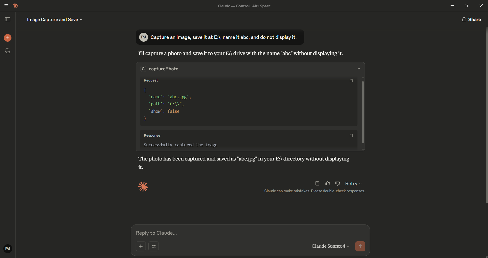

## 🧠 MCP Camera Controller

---

### 📿 What is the `Camera.py` file?

The `Camera.py` file is the **core component** of this project. It acts as a bridge between Claude and your Camera. When integrated with Claude’s tool-calling or external interface system, it allows Claude to:

* Open your camera and capture your photo.
* Save that captured image at your desired location.
* Execute those commands safely.

---

### ⚙️ What Variables You Need to Provide

To use the Camera MCP, you just need to define the following:

* **Path** – The directory where the captured image should be saved.
* **Name** – The filename for the captured image.
* **Show** – Whether you want to display the captured image or not.
* **Time** – Duration (in seconds) for which the image should be displayed.

The MCP server will interpret your intent, perform the requested camera operation, and return the result — such as the saved file path or success status.

You don’t need to worry about camera code or technical details — just describe what you want the camera to do.

---

