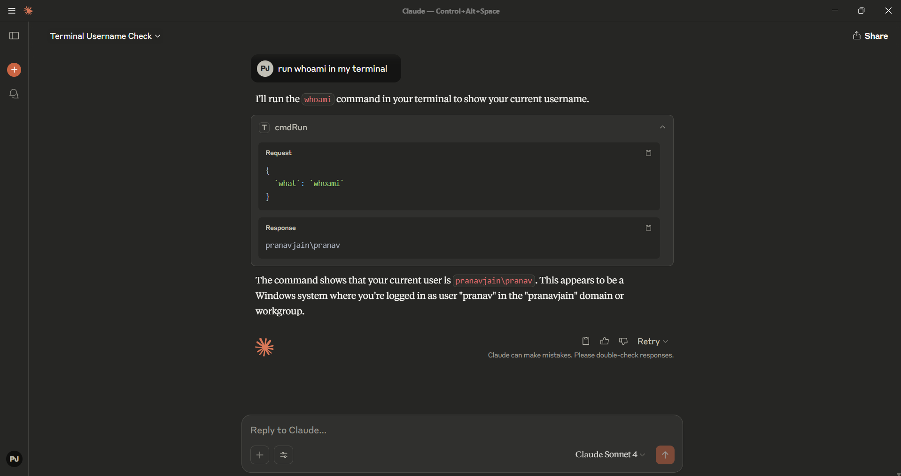

## 🧠 MCP Terminal Controller

---

### 📟 What is the `terminal.py` file?

The `terminal.py` file is the **core component** of this project. It acts as a bridge between Claude and your terminal. When integrated with Claude’s tool-calling or external interface system, it allows Claude to:

* Understand what terminal operations you want to perform.
* Execute those commands safely.
* Return the terminal output back to you.

---

### ⚙️ What Variables You Need to Provide

To use the terminal MCP, you just need to define **what task you want to do** in natural language or command-like form. For example:

```json
{
"what": "hostname"
}
```
or
```
I want to find the Hostname of my PC
```

The MCP server will interpret the intent, run the appropriate terminal command, and return the result.

You don’t need to worry about shell scripting or syntax — just describe what you want to do.

---

