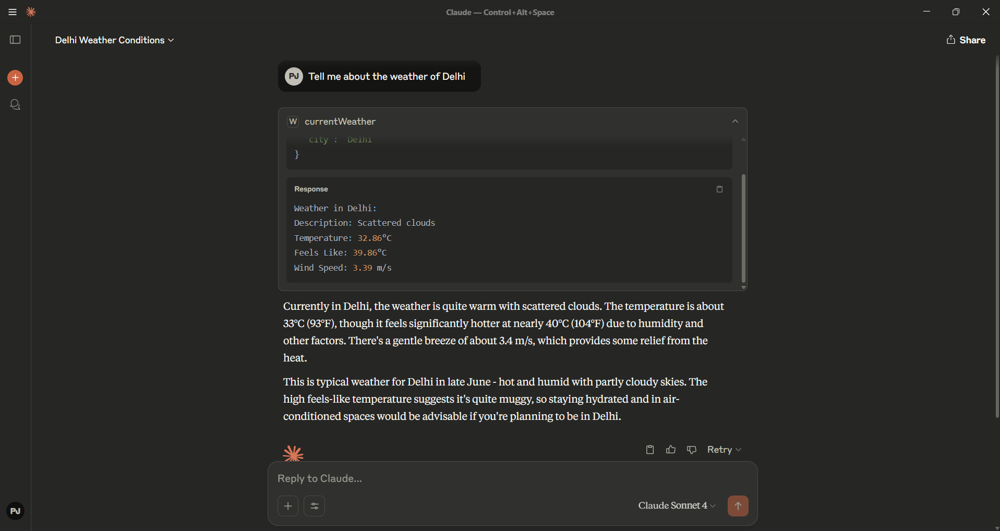

## 🌧️ MCP Weather Controller

---

### 📏 What is the `weather_mcp.py` file?

The `weather_mcp.py` file is the **core component** of this project. It acts as a bridge between **Claude** and the **OpenWeather API**. When integrated with Claude’s tool-calling or external interface system, it allows Claude to:

* Fetch the current weather information for any location.
* Safely call the OpenWeather API using your provided API key.
* Return weather data such as temperature, humidity, and condition summaries in a user-friendly format.

---

### ⚙️ What Variable You Need to Provide

To use the Weather MCP, you just need to define the following:

* **Location** – The name of the city or place for which you want to know the current weather.

In addition, make sure you have an OpenWeather API key saved in a `.env` file with the variable name:

```
apiWeather = your_openweather_api_key_here
```

The MCP server will interpret your request, fetch the current weather for the specified location, and return the result in a clear, readable format.

You don’t need to worry about API calls or response formats — just describe the location you want the weather for.

